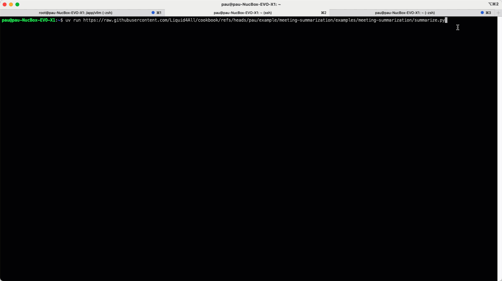

# Meeting summarization CLI

[English](README.md) | [中文](README_zh.md)


[](https://discord.com/invite/liquid-ai)



This example is a 100% local meeting summarization tool, that runs on your machine thanks to:

- [`LiquidAI/LFM2-2.6B-Transcript`](https://huggingface.co/LiquidAI/LFM2-2.6B-Transcript) -> a small language model specialized in summarizing meeting transcripts.

- [`llama.cpp`](https://github.com/ggerganov/llama.cpp) -> a fast inference engine with a minimal setup and state-of-the-art performance on a wide range of hardware, both locally and in the cloud.

This tool can be piped with an audio transcription model to map

- audio files to their corresponding transcripts, and
- transform the transcripts into summaries using this tool.

This 2-step pipeline can be run on your machine, without any cloud services or API keys.

Isn't that beautiful?

## Quick start

1. Install `uv` if you don't have it already. Follow instructions [here](https://docs.astral.sh/uv/getting-started/installation/) to install it.

2. Run the tool without cloning the repository using a `uv run` one-liner:
  
    ```sh
    uv run https://raw.githubusercontent.com/Liquid4All/cookbook/refs/heads/main/examples/meeting-summarization/summarize.py
    ```

    The previous command uses [this default transcript file](https://raw.githubusercontent.com/Liquid4All/cookbook/refs/heads/main/examples/meeting-summarization/transcripts/example_1.txt) to summarize the meeting.

3. If you want to use a different transcript file, you can pass the `--transcript-file` argument explicitly, either as a local file path or as an HTTP/HTTPS URL, and the tool will automatically download and use it.

    For example, to use [this other file](https://raw.githubusercontent.com/Liquid4All/cookbook/refs/heads/main/examples/meeting-summarization/transcripts/example_2.txt) you can run:

    ```sh
    uv run https://raw.githubusercontent.com/Liquid4All/cookbook/refs/heads/main/examples/meeting-summarization/summarize.py \
      --transcript-file https://raw.githubusercontent.com/Liquid4All/cookbook/refs/heads/main/examples/meeting-summarization/transcripts/example_2.txt
    ```


4. If you want to dig deeper into the code, experiment with it, and modify it, you can clone the repository

    ```sh
    git clone https://github.com/Liquid4All/cookbook.git
    cd cookbook/examples/meeting-summarization
    ```

    and run the summarization CLI using the following command:

    ```sh
    uv run summarize.py \
      --model LiquidAI/LFM2-2.6B-Transcript-GGUF \
      --hf-model-file LFM2-2.6B-Transcript-1-GGUF.gguf \
      --transcript-file transcripts/example_1.txt
    ```

## How does it work?

The CLI uses the llama.cpp Python bindings to download and build the llama.cpp binary for your platform automatically, so you don't need to worry about it. The build is optimized for your platform, so you can use it on your machine without any other setup.

Then, it uses the `LiquidAI/LFM2-2.6B-Transcript` model to summarize the transcript.

```python
model = Llama(
    model_path="LiquidAI/LFM2-2.6B-Transcript-GGUF",
    n_ctx=8192,
    n_threads=4,
    verbose=False,
)
```

Tokens are streamed to the console as they are generated, so you can see the summary being generated in real-time.

```python
stream = model.create_chat_completion(
    messages=[
        {"role": "system", "content": system_prompt},
        {"role": "user", "content": transcript}
    ],
    max_tokens=2048,
    temperature=0.0,
    top_p=0.9,
    stream=True,  # Enable streaming
)

for chunk in stream:
    delta = chunk['choices'][0]['delta']
    if 'content' in delta:
        token = delta['content']
        summary_text += token
        console.print(token, end='', highlight=False)

```

## Next steps

- [ ] Integrate the CLI into a 2-step pipeline that transcribes audio files to transcripts and then summarizes them.