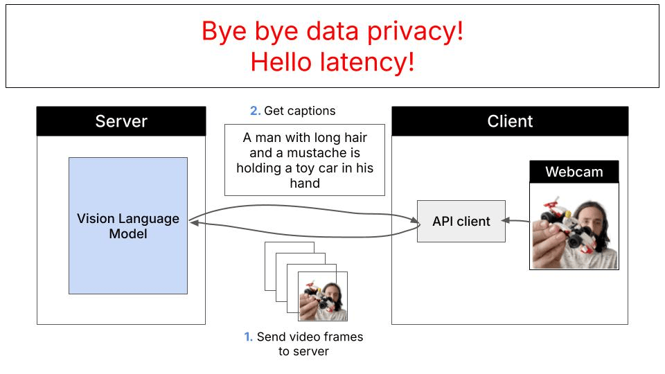
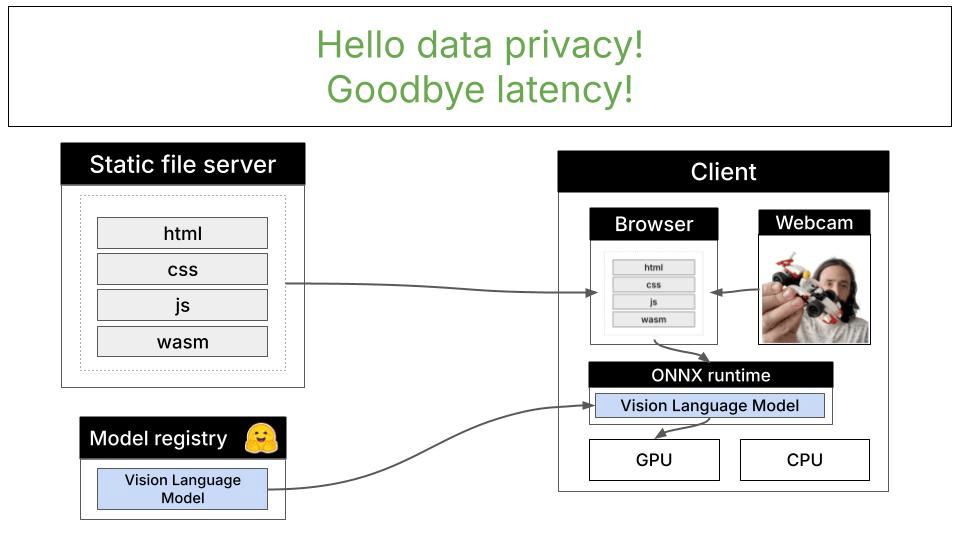
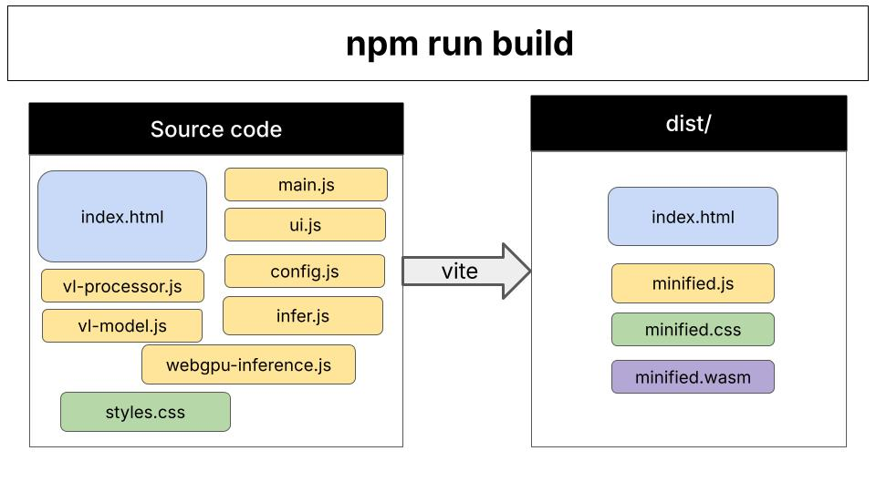

# 使用 LFM2.5-VL-1.6B 与 WebGPU 实现实时视频字幕

[English](README.md) | [中文](README_zh.md)


[](https://huggingface.co/spaces/LiquidAI/LFM2.5-VL-1.6B-WebGPU/tree/main)
[](https://discord.com/invite/liquid-ai)

该示例展示如何使用 LFM2.5-VL-1.6B 模型与 ONNX Runtime 在浏览器中运行本地视觉语言模型。

这是一个基于 WebGPU 的视觉语言模型演示，请确保使用支持 WebGPU 的浏览器（如 Chrome 或 Edge）。

你可以在 [这个 Hugging Face Space](https://huggingface.co/spaces/LiquidAI/LFM2.5-VL-1.6B-WebGPU/tree/main) 中找到完整代码。

## 目录

- [传统方案：云端推理](#传统方案云端推理)
- [本地替代方案：浏览器内 WebGPU 推理](#本地替代方案浏览器内-webgpu-推理)
  - [主要优势](#主要优势)
- [如何在本地运行应用](#如何在本地运行应用)
- [如何部署到生产环境](#如何部署到生产环境)
  - [代码组织方式](#代码组织方式)
- [给非 Node.js 开发者的常见问题](#给非-nodejs-开发者的常见问题)
  - [``npm run`` 是做什么的？](#npm-run-是做什么的)
  - [Vite 是什么？](#vite-是什么)
- [需要帮助？](#需要帮助)


## 传统方案：云端推理

通常，视觉语言模型推理遵循服务端-客户端架构：应用把图片和提示词发送到云端模型（如 Claude、GPT-4V 或 Gemini），模型在强大的服务器上处理请求并返回结果：



该方式适用于很多场景，但也有一些限制：

- **隐私问题**：图片与数据必须发送到外部服务器
- **延迟**：网络往返造成延迟，实时应用尤为明显
- **成本**：API 调用按使用量计费
- **依赖网络**：需要稳定互联网连接
- **速率限制**：受 API 配额与限流影响

## 本地替代方案：浏览器内 WebGPU 推理

该演示展示了一种不同方式：使用 WebGPU 在浏览器内完成视觉语言模型推理。LFM2.5-VL-1.6B 模型（16 亿参数，已量化）直接在设备上运行，不会将数据发送到任何地方。



### 主要优势

- **完全隐私**：数据始终留在本机
- **低延迟**：无网络开销，适合实时视频处理
- **零推理成本**：模型下载后不再产生 API 费用
- **可离线运行**：模型缓存后可离线使用
- **无速率限制**：处理能力由硬件决定

## 如何在本地运行应用

1. 克隆仓库：
   ```sh
   git clone https://huggingface.co/spaces/LiquidAI/LFM2.5-VL-1.6B-WebGPU/
   cd LFM2.5-VL-1.6B-WebGPU
   ```

2. 确保系统已安装 `npm`（Node 包管理器）：
   ```sh
   npm --version
   ```

   如果命令报错，说明你没有安装 `npm`，需要先安装才能构建此演示。如果你是 Python 生态的开发者，可以把 `npm` 理解为 Node.js 版的 `pip`。

   [下载安装 Node.js 与 npm](https://docs.npmjs.com/downloading-and-installing-node-js-and-npm)

3. 使用 `npm` 安装 `package.json` 中的依赖
   ```sh
   npm install
   ```
   
4. 启动开发服务器：
   ```sh
   npm run dev
   ```

   开发服务器启动后会提供本地 URL（通常为 `http://localhost:5173`），你可以在浏览器中打开应用。

5. 可选：使用 Docker 在本地运行

   如果你想使用 Docker 本地测试生产构建：

   ```sh
   # 构建 Docker 镜像
   docker build -t lfm-vl-webgpu -f LFM2.5-VL-1.6B-WebGPU/Dockerfile .

   # 运行容器
   docker run -p 7860:7860 lfm-vl-webgpu
   ```

   然后在浏览器中访问 `http://localhost:7860`。


## 如何部署到生产环境

执行 `npm run build` 后，你会在 `dist/` 目录得到可用于生产的打包产物。



这个静态网站可以部署到任意静态托管服务，例如：

- **HuggingFace Space**（仅用于演示）。它会自动使用目录根部的 Dockerfile。在线演示见 [这里](https://huggingface.co/spaces/LiquidAI/LFM2.5-VL-1.6B-WebGPU)。

- **平台即服务（PaaS）**
  - Vercel
  - Netlify

- **对象存储 + CDN**
  - AWS S3 + CloudFront
  - GCS + Cloud CDN
  - Azure Blob + CDN
- **传统 Web 服务器**
  - nginx
  - Apache
  - Caddy

**重要**：该应用需要特定的 CORS 头以启用 WebGPU 和 SharedArrayBuffer。例如 GitHub Pages 不支持这些头部，因此无法用它托管该应用。


### 代码组织方式

**Vite 的作用**：Vite 是构建工具，负责将所有 JavaScript 文件与依赖打包为优化后的浏览器代码。开发阶段（`npm run dev`）提供热更新服务；生产阶段（`npm run build`）在 `dist/` 目录生成压缩产物。

**代码结构**：应用采用模块化架构并进行职责分离：

- **入口**（`index.html` → `main.js`）：初始化应用、设置事件监听、协调模块
- **配置**（`config.js`）：模型定义、HuggingFace URL、量化选项
- **推理流水线**（`infer.js` → `webgpu-inference.js` → `vl-model.js`）：
  - 路由推理请求
  - 管理模型生命周期与状态
  - 处理 ONNX Runtime 会话与 token 生成
- **图像处理**（`vl-processor.js`）：将摄像头帧预处理为模型所需的 patch 与 tensor
- **UI 层**（`ui.js`）：更新 DOM、显示进度、展示字幕

每个 JavaScript 文件都是 ES 模块，通过导出/导入函数保持代码组织与可维护性。Vite 会自动处理模块解析与打包。

## 给非 Node.js 开发者的常见问题

### ``npm run`` 是做什么的？

`npm run` 用于执行 `package.json` 中定义的自定义脚本。
在 `package.json` 的 "scripts" 部分定义脚本：
```json
// package.json
{
   "name": "lfm25-vl-webgpu",
   ...
   "scripts": {
      "dev": "vite",
      "build": "vite build",
      "preview": "vite preview"
   },
}
```
然后通过以下命令运行：
- `npm run dev      # 运行 "vite"`
- `npm run build    # 运行 "vite build"`
- `npm run preview     # 运行 "jest"`

所以 npm run 本质上是 npm 的任务运行器，让你定义并执行项目特定命令。

### Vite 是什么？

`vite` 是现代前端构建工具，主要有两个用途：

1. **开发服务器**（`npm run dev`）：本地提供热更新服务，代码改动后立即刷新。类似 Flask 的 `debug=True` 或 Django 的 `runserver`，但针对 JS 模块做了优化并且速度极快。

2. **生产构建**（`npm run build`）：将源码（`.js`、`.css`、静态资源）转换并优化为可生产部署的产物，体积更小、加载更高效。

**Python 类比：** Vite 相当于把 `uvicorn --reload`（快速开发服务器）与 `setuptools`（构建/打包工具）合二为一，专为现代 Web 开发而设计。

## 需要帮助？

加入 [Liquid AI Discord 社区](https://discord.com/invite/liquid-ai) 并提问。

[](https://discord.com/invite/liquid-ai)
